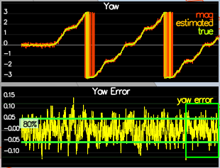
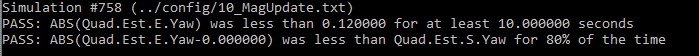

# Building an Estimator  

  

In this project, the estimation portion of the controller used in the CPP simulator needs to be developed. By the end of the project, the simulated quadrotor will be flying with the estimator and the custom controller from the previous project.

**The Tasks:**  

  Step 1: Determine the standard deviation of the measurement noise of both GPS X data and Accelerometer X data.  
  Step 2: Implement a better rate gyro attitude integration scheme in the UpdateFromIMU() function.  
  Step 3: Implement all of the elements of the prediction step for the estimator.  
  Step 4: Implement the magnetometer update.  
  Step 5: Implement the GPS update.  
  Step 6: De-tune the controller to successfully fly the final desired box trajectory with your estimator and realistic sensors.  
  
---
**Step 1. Determine the standard deviation of the measurement noise of both GPS X data and Accelerometer X data.**
---

For better estimation of the standard deviations I changed the sensor simulation to capture over 16,000 GPS points and 320,000 Accelerometer points.

*Process the logged files config/log/Graph1.txt (GPS X data) and config/log/Graph2.txt (Accelerometer X data) to figure out the standard deviation of the the GPS X signal and the IMU Accelerometer X signal.*  

The calculated GPS Standard Deviation was 0.706 and accelerometer standard deviation was 0.501.  The sampled GPS and accelerometer measurements were both approximately Gaussian as can be seen in the figures below.

  
 
  

 *Plug in your result into the top of config/6_Sensornoise.txt. Specially, set the values for MeasuredStdDev_GPSPosXY and MeasuredStdDev_AccelXY to be the values you have calculated.*  
 
The standard deviations were updated in config/6_Sensornoise.txt.  

*Run the simulator. If your values are correct, the dashed lines in the simulation will eventually turn green, indicating you’re capturing approx 68% of the respective measurements (which is what we expect within +/- 1 sigma bound for a Gaussian noise model)*  

Here is the simulation of the sensor noise:  

  

The simulator passed the test.

  

---
**Step 2. Implement a better rate gyro attitude integration scheme in the UpdateFromIMU() function.**  
---
*The improved integration scheme should result in an attitude estimator of < 0.1 rad for each of the Euler angles for a duration of at least 3 seconds during the simulation. The integration scheme should use quaternions to improve performance over the current simple integration scheme.*  

The old code used a small-angle approximation integration method to update the predicted attitude. 

Old Code:  

    float predictedPitch = pitchEst + dtIMU * gyro.y;
    float predictedRoll = rollEst + dtIMU * gyro.x;
    ekfState(6) = ekfState(6) + dtIMU * gyro.z;	// yaw. 

The new code uses a better integration of the current attitude estimates (rollEst, pitchEst and ekfState(6)).

Formulas used:  

  

New Code:  

    Quaternion<float> qt = Quaternion<float>::FromEuler123_RPY(rollEst, pitchEst, ekfState(6));
    Quaternion<float> qt_bar = qt;
    qt_bar.IntegrateBodyRate(gyro, dtIMU);   

    float predictedRoll = qt_bar.Roll();       // Get roll from quaterion
    float predictedPitch = qt_bar.Pitch();     // Get pitch from quaterion
    ekfState(6) = qt_bar.Yaw();                // Get yaw from quaterion  

  

Above on the left is the attitude error using the old code and on the right is the attitude error using the new code.

The attitude estimation simulation was run...  

  

... and the simulation passed the test.  

  

---
**Step 3. Implement all of the elements of the prediction step for the estimator.**  
---
*The prediction step should include the state update element (PredictState() function), a correct calculation of the Rgb prime matrix, and a proper update of the state covariance. The acceleration should be accounted for as a command in the calculation of gPrime. The covariance update should follow the classic EKF update equation.*  

**A. State Update:**     
    
State transition function used:

Code:  

    V3F accel_i = attitude.Rotate_BtoI(accel);          //rotate vector from body to inertial frame

    predictedState(0) = curState(0) + curState(3) * dt;           // x_bar
    predictedState(1) = curState(1) + curState(4) * dt;           // y_bar
    predictedState(2) = curState(2) + curState(5) * dt;           // z_bar
    predictedState(3) = curState(3) + accel_i.x * dt;             // x_dot_bar
    predictedState(4) = curState(4) + accel_i.y * dt;             // y_dot_bar
    predictedState(5) = curState(5) + (accel_i.z - 9.81f) * dt;   // z_dot_bar

Above on the left is the predicted state before implementing the above code and on the right is the predicted state after implementating the state transition function.

Here is the simulation of the predicted state:  

**B. Calculation of the Rgb Prime Matrix:**  

Formula used:  

  

Code:  

    float phi = pitch;
    float theta = roll;
    float psi = yaw;

    RbgPrime(0, 0) = -cos(theta)*sin(psi);
    RbgPrime(1, 0) =  cos(theta)*cos(psi);
    RbgPrime(2, 0) = 0;

    RbgPrime(0, 1) = -sin(phi)*sin(theta)*sin(psi) - cos(phi)*cos(psi);
    RbgPrime(1, 1) =  sin(phi)*sin(theta)*cos(psi) - cos(phi)*sin(psi);
    RbgPrime(2, 1) = 0;

    RbgPrime(0, 2) = -cos(phi)*sin(theta)*sin(psi) + sin(phi)*cos(psi);
    RbgPrime(1, 2) =  cos(phi)*sin(theta)*cos(psi) + sin(phi)*sin(psi);
    RbgPrime(2, 2) = 0;

**C. Update of the State Covariance**    

Formula used:

  

Code:  

    gPrime(0, 3) = dt;
    gPrime(1, 4) = dt;
    gPrime(2, 5) = dt;

    gPrime(3, 6) = (RbgPrime(0, 0) * accel.x * RbgPrime(0, 1) * accel.y * RbgPrime(0, 2) * accel.z) * dt;
    gPrime(4, 6) = (RbgPrime(1, 0) * accel.x * RbgPrime(1, 1) * accel.y * RbgPrime(1, 2) * accel.z) * dt;
    gPrime(5, 6) = (RbgPrime(2, 0) * accel.x * RbgPrime(2, 1) * accel.y * RbgPrime(2, 2) * accel.z) * dt;

Formula used:

  

Code:  

    MatrixXf gPrimeT = gPrime;
    gPrimeT.transposeInPlace();
    ekfCov = gPrime * ekfCov * gPrimeT + Q;

I updated QPosXYZStd:  

    QPosXYStd = 0.03  # updated from 0.5

  

Above on the left is the covariance prediction before implementating the covariance state update and on the right is after implementation.  

---
**Step 4. Implement the Magnetometer Update.**  
---
*The update should properly include the magnetometer data into the state. Note that the solution should make sure to correctly measure the angle error between the current state and the magnetometer value (error should be the short way around, not the long way).*  

Formulas used:  

  

Code:  

    zFromX(0) = ekfState(6);
    hPrime(0, 6) = 1;

    // Normalize the Yaw Difference
    // Error should be the short way around, not the long way.

    float yawDiff = magYaw - ekfState(6);

    if (yawDiff > F_PI) {
	   zFromX(0) += 2.f*F_PI;
    }
    else if (yawDiff < -F_PI) {
	   zFromX(0) -= 2.f*F_PI;
    }

I updated QYawStd:

    QYawStd = 0.08  # updated from 0.05

  

Above on the left is the Yaw error before implementing the Magnetometer update and on the right is after implementation.

Here is the simulation of the magnetometer update:  

The simulation passed the tests:  

  
---  
**Step 5. Implement the GPS update.**  
---
*The estimator should correctly incorporate the GPS information to update the current state estimate.*  

Formulas used:  

  

Code:  

    zFromX(0) = ekfState(0);
    zFromX(1) = ekfState(1);
    zFromX(2) = ekfState(2);
    zFromX(3) = ekfState(3);
    zFromX(4) = ekfState(4);
    zFromX(5) = ekfState(5);
  
    hPrime(0, 0) = 1;
    hPrime(1, 1) = 1;
    hPrime(2, 2) = 1;
    hPrime(3, 3) = 1;
    hPrime(4, 4) = 1;
    hPrime(5, 5) = 1;

  

Above on the left is the ___ before the GPS update and on the right is after implementation.  

Here is the simulation of the GPS update:  

The simulation passed the test:  

  

---
**Step 6: Adding Your Controller**
---
*De-tune your controller to successfully fly the final desired box trajectory with your estimator and realistic sensors.*  

Here is the GPS Update simulation after adding my controller from the previous project and before de-tuning the control parameters:

A bit of luck of trial and error on the de-tuning - I decreased my position control gains by 50% and doubled my angle rate gains in order to pass the GPS Update.

    # Position control gains
    kpPosXY = 20 # updated from 40
    kpPosZ = 27.5 # updated from 55
    KiPosZ = 25 # updated from 50

    # Angle rate gains
    kpPQR = 80, 80, 20 # updated from 40, 40, 10  

Here is the GPS Update simulation after adding my controller from the previous project and after de-tuning the control parameters:

The simulation passed the test:

---

**Final Parameters:**  

QuadControlParams.txt  

    # Position control gains
    kpPosXY = 20 # updated from 40
    kpPosZ = 27.5 # updated from 55
    KiPosZ = 25 # updated from 50

    # Velocity control gains
    kpVelXY = 15
    kpVelZ = 15

    # Angle control gains
    kpBank = 12    
    kpYaw = 4     

    # Angle rate gains
    kpPQR = 80, 80, 20 # updated from 40, 40, 10  

QuadEstimatorEKF.txt  

    QPosXYStd = .03  # updated from .05
    QPosZStd = .05
    QVelXYStd = .05
    QVelZStd = .1
    QYawStd = .08    # updated from .05

    # GPS measurement std deviations
    GPSPosXYStd = 1
    GPSPosZStd =  3 
    GPSVelXYStd = .1
    GPSVelZStd = .3

